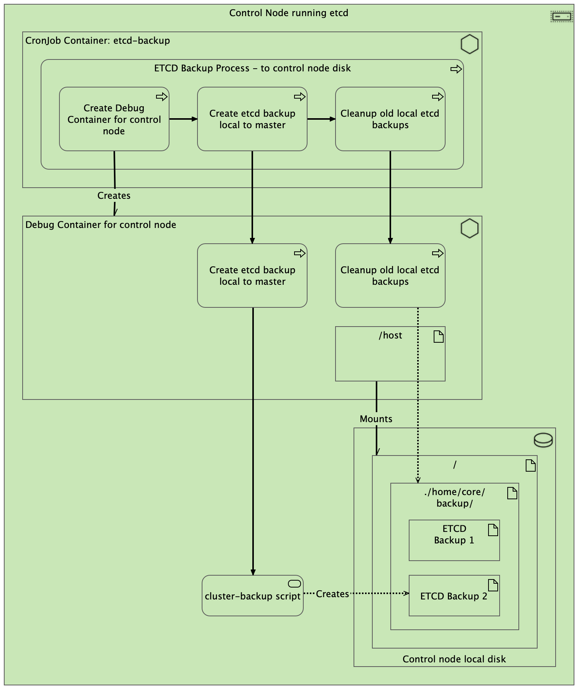
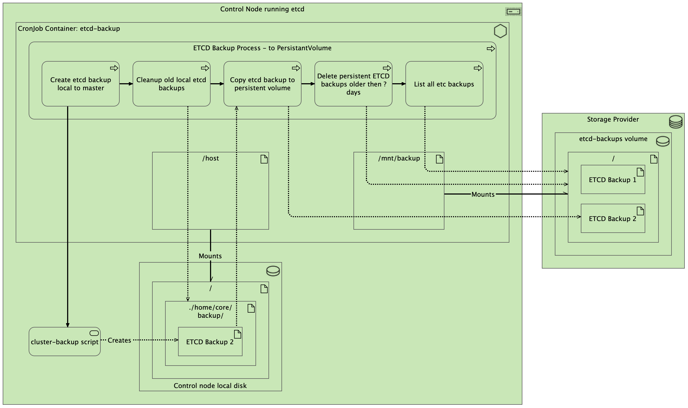

# OCP Disaster Recovery Part 4 - How to GitOps-ify Automated ETCD Backups to a PersistentVolume in OpenShift 4.x
By: Ian Tewksbury

This article is a natural extension of the wonderful article [OCP Disaster Recovery Part 1 - How to Create Automated ETCD Backup in OpenShift 4.x](https://cloud.redhat.com/blog/ocp-disaster-recovery-part-1-how-to-create-automated-etcd-backup-in-openshift-4.x).

Here we’ll discuss taking your etcd backups to the next level by:
1. Moving the etcd backups from the OpenShift control nodes to external storage
2. Managing the automated etcd backup kubernetes resources with GitOps

## External Storage for etcd backups

### Context
I enjoy and appreciate the OpenShift documentation probably more than your average person, spending a great deal of my week looking things up I have looked up ten times before. Every once in a while though, an approach in the documentation doesn’t tell the whole story. Such is the case with [Backing up etcd](https://docs.openshift.com/container-platform/4.10/backup_and_restore/control_plane_backup_and_restore/backing-up-etcd.html) where there are wonderful instructions for creating an etcd backup, on the node running etcd. This is great, if you happen to lose one of the other two etcd nodes, but what happens if you lose the node that your etcd backups are on? Bummer.

### Solution
Solution, PersistentVolumeClaim for storing etcd backups. This does kick the proverbial can down the road, in that now you need to worry about the resilience of the storage solution backing your PersistentVolumeClaim. However, for this article we will assume there exists a well architected and thought out high availability and disaster recovery plan for the storage backing the StorageClasses backing the PersistentVolume which the PersistentVolumeClaim will bind to. Even if you don’t have access to such gloriously designed storage, at the very least it will be storage not directly tied to the control plane nodes we are attempting to back up.

To accomplish this, we have to get sneaky, very very sneaky. [OCP Disaster Recovery Part 1 - How to Create Automated ETCD Backup in OpenShift 4.x](https://cloud.redhat.com/blog/ocp-disaster-recovery-part-1-how-to-create-automated-etcd-backup-in-openshift-4.x) very cleverly took the manual instructions from the backing up etcd documentation and automated them with a CronJob. The sneakiness we will layer on top of that approach is rather than having a CronJob create a debug node to then execute the backup in, we will make the CronJob a debug node. I could wax poetic in prose for a few more paragraphs on how this works, but here are some pictures instead.

*Previews backup to control node local disk process*


*New backup to external storage via PersistentVolumeClaim process*


The “magic” that makes the backup to PersistentVolumeClaim process works is that the container created by the CronJob has the same permissions and mounts that a debug container for a node has, and additionally has a PersistentVolumneClaim mounted to copy the etcd backup to.

Okay, great idea, but how do I do it?

## Automated etcd Backups GitOps

### Context
I could inline the five (5) kubernetes resources currently needed to make this all work right here for you to copy and paste into your cluster, but what happens when someone finds a bug? Or a way to do it better? I don’t want to be updating this blog post all the time and you don't want to have to be constantly checking back here for the latest and greatest updates to the approach. Additionally, I don’t want to be the facilitator of bad habits, because as we all well know, you  hould never be manually editing any OpenShift configuration directly, you should be teaching the robots to do it.

### Solution
Solution, the robot, aka, [OpenShift GitOps](https://docs.openshift.com/container-platform/4.10/cicd/gitops/understanding-openshift-gitops.html) ([ArgoCD](https://argoproj.github.io/cd/)). I will not recount all the reasons to use a GitOps approach here nor will I pontificate the wonders that is ArgoCD, both of those have been done in [great detail already](https://cloud.redhat.com/blog/tag/gitops). If you have no idea what I am referring to, go do a quick primer with
[Introduction to GitOps with OpenShift](https://cloud.redhat.com/blog/introduction-to-gitops-with-openshift) and then return.

### Helm chart
The https://github.com/redhat-cop/openshift-management project now has a configurable chart, [cronjob-etcd-backup](https://github.com/redhat-cop/openshift-management/tree/master/charts/cronjob-etcd-backup).

Whether you consume this Helm chart directly or copy the source into your own internal Helm charts repository to maintain your own lifecycle it is there for you to use. This is community created and maintained code so does not have any sort of official Red Hat support with it, but neither does a bunch of random YML copied from any blog, so at least this content is in an active community, in a form you can perform pull requests against, or easily fork and maintain in your own way.

### The Robot
Of course the [cronjob-etcd-backup](https://github.com/redhat-cop/openshift-management/tree/master/charts/cronjob-etcd-backup) Helm chart on its own does not constitute GitOps if you run a manual helm upgrade –install against the helm chart. There are an enumerable number of ways you can configure [OpenShift GitOps](https://docs.openshift.com/container-platform/4.10/cicd/gitops/understanding-openshift-gitops.html) ([ArgoCD](https://argoproj.github.io/cd/)) to consume, or generate via API, Application custom resources to begin the automated reconciliation loop. Rather than discuss all of those now, here is a sample Application custom resource you could configure in [OpenShift GitOps](https://docs.openshift.com/container-platform/4.10/cicd/gitops/understanding-openshift-gitops.html) ([ArgoCD](https://argoproj.github.io/cd/)) in your way of choosing. Personally, I wouldn't even do it this way, I would use an infra GitOps repo using [ApplictionSet](https://blog.argoproj.io/introducing-the-applicationset-controller-for-argo-cd-982e28b62dc5)s but that is too much to cover here. Ultimately, so long as you are somehow source controlling the configuration that [OpenShift GitOps](https://docs.openshift.com/container-platform/4.10/cicd/gitops/understanding-openshift-gitops.html) ([ArgoCD](https://argoproj.github.io/cd/))  is reading to apply the etcd backup resources, you will be in good shape.

```yml
apiVersion: argoproj.io/v1alpha1
kind: Application
metadata:
  name: openshift-etcd-backup
spec:
  destination:
    name: ''
    namespace: openshift-etcd-backup
    server: 'https://kubernetes.default.svc'
  source:
    path: charts/cronjob-etcd-backup
    repoURL: 'https://github.com/redhat-cop/openshift-management.git'
    targetRevision: master
    helm:
      values: |
        pvcStorage: 100Gi
        pvcStorageClassName:
        cronJobSchedule: '5 0 * * *'
        cronJobDaysToKeepPersistentETCDBackups: 5
  project: default
  syncPolicy:
    automated:
      prune: true
      selfHeal: true
    syncOptions:
      - CreateNamespace=true
```

If you want to fork the helm chart so as not to flow directly from the upstream you could update the repoURL and targetRevision accordingly.

### A note on permissions
If you are the type of person who likes to read through the code you are about to deploy to your cluster before you actually deploy it, first I applaud you, and second you will notice the permissions given to the CronJob created container created by the Helm chart appear to be extreme.

The container created by the CronJob will need permissions to mount host file systems and run as privileged so as to be able to sudo on the host to run the etcd backup. At first glance this may seem like far more permissions than the previous method. However, the manual approach, or automated flavor, gave the same permissions in that it gave permissions to create a debug container for a control node, which in turn had the elevated permissions. Therefore, the resulting permissions set for the new approach is actually less then the original method in that the container created by the CronJob is limited to running on control nodes and not any nodes but the original method allowed a debug container to be created for any node.

## Conclusion
Will a backup of etcd save you from every possible disaster recovery scenario, most definitely not. Is it still worth having, absolutely. Is it worth having if it's backed up on the same nodes that it is trying to backup, not so much. Should you be manually performing these backups, and transfers thus generating more toil for your team, assuredly not. Hopefully this approach not only improves your disaster recovery scenario preparedness, but for some of you it nudged you in the direction of performing such retune operations by using GitOps based on community driven solutions to common problems.
